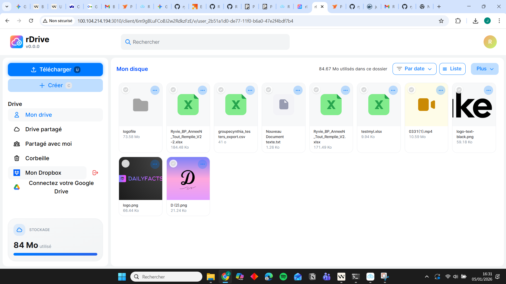
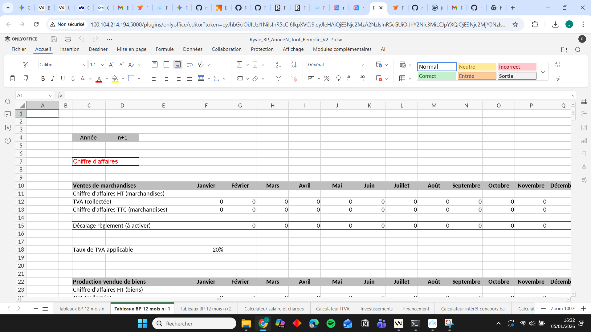

# Ryvie rDrive

<p align="center">
  
</p>

<p align="center">
  <b>Solution de stockage cloud open-source avec support OnlyOffice</b><br />
  <i>Alternative auto-hébergée à Google Drive avec accès local et distant</i>
</p>

<p align="center">
  <a href="#-fonctionnalités">Fonctionnalités</a> •
  <a href="#-architecture">Architecture</a> •
  <a href="#-installation">Installation</a> •
  <a href="#-configuration">Configuration</a> •
  <a href="#-utilisation">Utilisation</a> •
  <a href="#-sécurité">Sécurité</a>
</p>

---

## Aperçu

### Interface principale

<p align="center">
  
  <br>
  <i>Interface de gestion des fichiers avec navigation intuitive</i>
</p>

### Éditeur OnlyOffice

<p align="center">
  
  <br>
  <i>Édition collaborative de documents Excel avec OnlyOffice</i>
</p>

---

## 🚀 Fonctionnalités

- **📁 Gestion de fichiers** : Upload, download, organisation en dossiers
- **📝 Édition collaborative** : OnlyOffice intégré (Word, Excel, PowerPoint)
- **🌐 Accès hybride** : Fonctionne en réseau local ET à distance via VPN
- **🔄 Synchronisation** : Partage de fichiers entre utilisateurs
- **🔐 Authentification** : Support LDAP et OAuth (Google, Dropbox)
- **📱 Responsive** : Interface adaptée mobile et desktop

## 🏗️ Architecture

### Mode d'accès automatique

rDrive détecte automatiquement le mode d'accès et adapte sa configuration :

#### **Mode Local** (réseau privé)
```
Client (10.128.255.99)
    ↓
Frontend (10.128.255.101:3010)
    ↓
Backend (10.128.255.101:4000)
    ↓
OnlyOffice (10.128.255.101:8090)
```

#### **Mode Remote** (via NetBird VPN)
```
Client distant
    ↓ NetBird VPN
Frontend (100.104.214.194:3010)
    ↓
Backend (100.104.214.194:4000)
    ↓
OnlyOffice (100.104.214.194:8090)
```

### Détection automatique

Le frontend détecte l'origine de la requête :
- **Local** : IP `10.x`, `192.168.x`, `172.x`, `localhost`, `ryvie.local`
- **Remote** : Toute autre IP (ex: NetBird `100.x`)

Les URLs sont générées dynamiquement selon le contexte d'accès.

## 📦 Installation

### Prérequis

- Docker & Docker Compose
- 4 GB RAM minimum
- 20 GB espace disque
- (Optionnel) NetBird pour l'accès distant

### Étapes

1. **Cloner le repository**
   ```bash
   git clone https://github.com/maisonnavejul/Ryvie-rDrive.git
   cd Ryvie-rDrive/tdrive
   ```

2. **Configurer l'environnement**
   ```bash
   cp .env.example .env
   nano .env
   ```

3. **Démarrer les services**
   ```bash
   docker compose up -d
   ```

4. **Accéder à l'application**
   - Local : `http://10.128.255.101:3010`
   - Remote (NetBird) : `http://100.104.214.194:3010`

## ⚙️ Configuration

### Fichier `.env`

```bash
# URLs publiques (pour accès remote via NetBird)
REACT_APP_FRONTEND_URL=http://100.104.214.194:3010
REACT_APP_BACKEND_URL=http://100.104.214.194:4000
REACT_APP_WEBSOCKET_URL=ws://100.104.214.194:4000/ws
REACT_APP_ONLYOFFICE_CONNECTOR_URL=http://100.104.214.194:5000
REACT_APP_ONLYOFFICE_DOCUMENT_SERVER_URL=http://100.104.214.194:8090

# IP privée pour détection locale
REACT_APP_FRONTEND_URL_PRIVATE=10.128.255.101

# Secrets (générer des valeurs aléatoires sécurisées)
LDAP_BIND_PASSWORD=your_secure_password
DROPBOX_APPKEY=your_dropbox_key
DROPBOX_APPSECRET=your_dropbox_secret
GOOGLE_CLIENT_ID=your_google_client_id
GOOGLE_CLIENT_SECRET=your_google_client_secret
```

### Configuration OnlyOffice

Le connecteur OnlyOffice est configuré dans `docker-compose.yml` :

```yaml
onlyoffice-connector:
  environment:
    - CREDENTIALS_ENDPOINT=http://localhost:4000/
    - ONLY_OFFICE_SERVER=http://localhost:8090/
```

Ces URLs utilisent `localhost` car le connecteur est en mode `network_mode: host`, permettant l'accès aux services locaux même si NetBird est arrêté.

## 🎯 Utilisation

### Accès Local (sans NetBird)

1. Accéder à `http://10.128.255.101:3010`
2. Se connecter avec vos identifiants
3. Tous les services fonctionnent via le réseau local

### Accès Remote (avec NetBird)

1. Démarrer NetBird : `sudo systemctl start netbird`
2. Accéder à `http://100.104.214.194:3010`
3. Les services sont accessibles via le VPN

### Gestion NetBird

```bash
# Démarrer NetBird
sudo systemctl start netbird

# Arrêter NetBird (l'accès local continue de fonctionner)
sudo systemctl stop netbird

# Redémarrer NetBird
sudo systemctl restart netbird

# Statut
sudo systemctl status netbird
```

## 🔐 Sécurité

### Points forts

✅ **Authentification JWT** : Tokens avec expiration automatique  
✅ **Séparation des tokens** : Access, refresh, et in_page_token distincts  
✅ **Pas de credentials en clair** : Variables d'environnement sécurisées  
✅ **CORS automatique** : Détection d'origine et headers adaptés  
✅ **VPN chiffré** : NetBird pour l'accès distant sécurisé  

### Recommandations

⚠️ **Ne jamais commiter le fichier `.env`** (déjà dans `.gitignore`)  
⚠️ **Utiliser des mots de passe forts** pour LDAP et autres services  
⚠️ **Activer HTTPS** en production avec Let's Encrypt  
⚠️ **Mettre à jour régulièrement** les images Docker  

### Configuration HTTPS (Production)

Pour activer HTTPS avec Let's Encrypt :

```bash
# Dans docker-compose.yml, modifier le frontend
environment:
  - SSL_CERTS=on
  - DOMAIN=votre-domaine.com

# Redémarrer
docker compose restart frontend
```

## 🛠️ Développement

### Lancer le frontend en mode dev

```bash
cd tdrive/frontend
npm install
DISABLE_ESLINT_PLUGIN=true BROWSER=none npm run dev:start
```

Le frontend sera disponible sur `http://localhost:3000`

### Rebuild d'un service

```bash
# Rebuild du frontend
docker compose up -d --build frontend

# Rebuild du connecteur OnlyOffice
docker compose up -d --build onlyoffice-connector

# Rebuild de tous les services
docker compose up -d --build
```

### Logs

```bash
# Tous les services
docker compose logs -f

# Service spécifique
docker compose logs -f frontend
docker compose logs -f node
docker compose logs -f onlyoffice-connector
```

## 🐛 Dépannage

### OnlyOffice ne charge pas les fichiers

**Symptôme** : "Échec du téléchargement" ou "Impossible d'enregistrer"

**Solution** : Vérifier que le connecteur utilise les bonnes URLs
```bash
docker compose logs onlyoffice-connector | grep "Connector Server URL"
```

### NetBird ne démarre pas

**Solution** : Vérifier le statut et les logs
```bash
sudo systemctl status netbird
sudo journalctl -u netbird -f
```

### Services ne démarrent pas

**Solution** : Vérifier les dépendances et la santé des conteneurs
```bash
docker compose ps
docker compose logs
```

## 📊 Architecture Technique

### Stack

- **Frontend** : React + TypeScript
- **Backend** : Node.js + Express
- **Base de données** : MongoDB
- **Stockage** : Local filesystem (configurable S3)
- **Édition** : OnlyOffice Document Server
- **Authentification** : JWT + LDAP/OAuth
- **VPN** : NetBird (WireGuard)

### Ports

| Service | Port | Description |
|---------|------|-------------|
| Frontend | 3010 | Interface web |
| Backend | 4000 | API REST + WebSocket |
| OnlyOffice Connector | 5000 | Pont OnlyOffice ↔ Backend |
| OnlyOffice Server | 8090 | Serveur de documents |
| MongoDB | 27017 | Base de données |
| RabbitMQ | 5672 | Queue OnlyOffice |
| PostgreSQL | 5433 | DB OnlyOffice |

## 📝 License

Ce projet est basé sur [Twake Drive](https://github.com/linagora/twake-drive) et est distribué sous licence [AGPL v3](LICENSE).

## 🤝 Contribution

Les contributions sont les bienvenues ! N'hésitez pas à ouvrir une issue ou une pull request.

---

<p align="center">
  Fait avec ❤️ par <a href="https://github.com/ryvieos">Ryvie</a>
</p>
